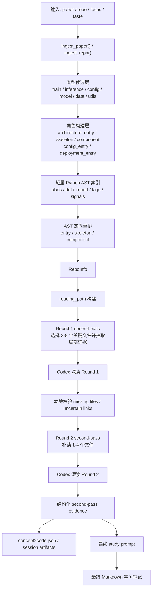

# Study Agent 架构细节图

这份文档补充 [README.md](/E:/my-embodied/README.md) 的实现视角，重点说明当前 `study-agent` 的主链路、两层候选结构、second-pass reading，以及本地如何保存结构化 `Concept2Code` 证据。

## 1. 总体链路



## 2. 仓库侧主数据流


## 3. 两层结构如何配合

### 类型候选层

类型候选层回答的是：

```text
这些文件大概属于什么类型？
```

典型字段包括：

- `train_candidates`
- `inference_candidates`
- `config_candidates`
- `model_candidates`
- `core_model_candidates`
- `deployment_policy_candidates`
- `data_candidates`
- `loss_candidates`
- `env_candidates`
- `docs_candidates`
- `utils_candidates`

### 角色构建层

角色构建层建立在类型候选层之上，回答的是：

```text
在 architecture 理解链路里，这些文件分别扮演什么角色？
```

典型字段包括：

- `architecture_entry_candidates`
- `architecture_skeleton_candidates`
- `architecture_component_candidates`
- `config_entry_candidates`
- `deployment_entry_candidates`

当前真实主链不是两棵平行树，而是：

```text
类型候选层 -> 角色构建层 -> AST 重排层 -> reading_path -> second-pass
```

## 4. `reading_path` 当前逻辑

在 `architecture` focus 下，当前阅读顺序是：

```text
architecture_entry
-> architecture_skeleton
-> architecture_component
-> config_entry
-> deployment_entry
```

可以把它理解成：

1. 先找顶层装配文件
2. 再看结构骨架文件
3. 再看底层组件文件
4. 最后补配置与部署/推理包装层

## 5. 当前 AST 在做什么

当前 AST 是轻量、文件级、服务排序与补读选择的，不是 full graph analysis。

它当前主要提供这些能力：

- 识别 `concrete_model`、`abstract_base`
- 识别 `skeleton_like`、`component_like`、`script_like`
- 识别 `forward / predict_action / encode / predict / rollout / get_cost` 这类架构行为信号
- 给 `entry / skeleton / component` 做候选池内定向重排
- 帮助 Round 2 校验某个补读文件是否值得采纳

它目前还没有做这些更重的事：

- 全仓调用图
- 通用 PageRank
- Tree-sitter 多语言解析
- 本地完整符号级推理器

## 6. second-pass reading 现在怎么工作

当前 second-pass 是固定两轮，不做无限递归。

### Round 1

本地先从第一遍排序结果中挑 3-8 个关键文件：

- 优先来自 `reading_path`
- 重点覆盖 `architecture_entry / skeleton`
- 必要时补 1 个 component
- 再补少量 train/config/eval 入口

随后本地会为这些文件抽取：

- 文件 excerpt
- top symbols
- 本地候选原因
- AST tags / reasons
- 相关 hits

这些证据再交给 Codex 做深读。

### Round 2

Codex 在 Round 1 中可以提出：

- `missing_files`
- `uncertain_links`

但这些建议不会被直接采用，而是要经过本地校验：

- 文件必须真实存在于 repo
- 文件必须和 Round 1 文件或已有链路有关系
- helper / script 噪音会被过滤
- 最多只补 1-4 个文件

然后再交给 Codex 做 Round 2 修正。

## 7. 结构化证据如何落盘

当前 session 不再只有：

- `request.json`
- `evidence.md`
- `output.md`

还会额外保存：

- `second-pass-round-1.json`
- `second-pass-round-1.md`
- `second-pass-round-2.json`
- `second-pass-round-2.md`
- `concept2code.json`

其中 `concept2code.json` 不是简单的 `concept -> file`，而是最小可复用证据单元，至少包含：

- `concept`
- `status`
- `files`
- `symbols`
- `evidence_span`
- `confidence`
- `reason`
- `round`

这让它后续可以接长期记忆，而不是只当一次性文本输出。

## 8. 当前阶段判断

当前已经完成的是：

- 类型候选层
- 角色构建层
- `entry / skeleton / component` 轻量 AST 重排
- 两轮 second-pass reading
- 结构化 `Concept2Code` 证据落盘

因此当前主线已经从“继续打磨排序层”转成：

```text
先用第一遍排序挑准关键文件，
再用 second-pass 深读和结构化证据强化 Concept2Code tracing。
```

还没有必要现在就上这些更重机制：

- full AST graph
- Tree-sitter
- 通用 centrality / PageRank
- 完整长期 memory / retrieval 系统

## 9. 一句话理解当前系统

```text
先把 repo 文件做粗分类，
再把 architecture 文件分成入口 / 骨架 / 组件，
再用轻量 AST 把顺序排得更像人第一次读代码的顺序，
然后挑 3-8 个关键文件做两轮 second-pass 深读，
最后把结论保存成结构化 Concept2Code 证据。
```
