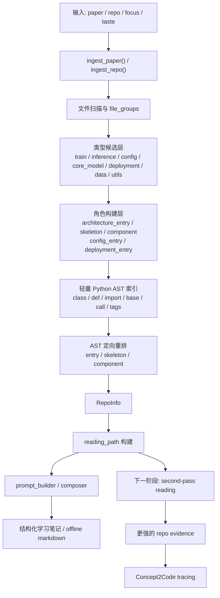
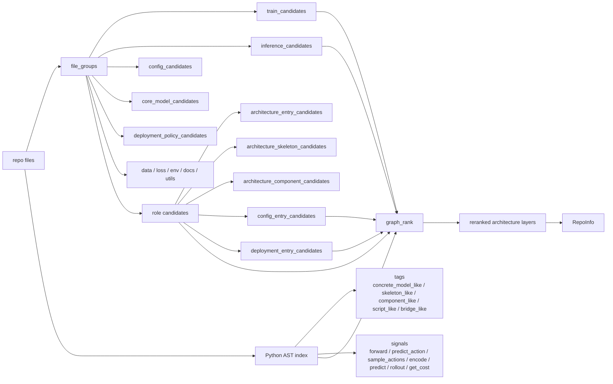

# Study Agent 架构图

这份文档用来补充 [README.md](/E:/my-embodied/README.md) 的实现视角，重点说明当前 `study-agent` 的仓库分析链路、角色分层方式，以及下一步 planned `second-pass reading` 在整体中的位置。

## 1. 整体构建链路



## 2. 当前仓库侧主数据流



## 3. `reading_path` 当前逻辑

在 `architecture` focus 下，当前阅读顺序已经不是单一混排，而是：

```text
architecture_entry
-> architecture_skeleton
-> architecture_component
-> config_entry
-> deployment_entry
```

可以把它理解成“先找主装配，再看骨架，再看底层组件，最后补配置和部署”。

## 4. 两层结构怎么配合

### 类型候选层

这一层回答的是：

```text
这些文件大概属于什么类型？
```

例如：

- `train_candidates`
- `inference_candidates`
- `config_candidates`
- `core_model_candidates`
- `deployment_policy_candidates`
- `data_candidates`
- `loss_candidates`
- `env_candidates`
- `docs_candidates`
- `utils_candidates`

### 角色构建层

这一层建立在类型层之上，回答的是：

```text
在 architecture 理解链路里，这些文件扮演什么角色？
```

例如：

- `architecture_entry_candidates`
- `architecture_skeleton_candidates`
- `architecture_component_candidates`
- `config_entry_candidates`
- `deployment_entry_candidates`

当前真实流程不是两棵平行树，而是：

```text
类型候选层 -> 角色构建层 -> AST 重排层 -> reading_path
```

## 5. 当前 AST 在做什么

当前 AST 是“轻量、文件级、服务排序”的，不是 full graph analysis。

它主要提供这些能力：

- 识别 concrete model / abstract base
- 识别 skeleton_like / component_like / script_like
- 看 train/eval/config 是否直接 import 或实例化某个 repo 内类
- 给 architecture entry / skeleton / component 做候选池内重排

它**还没有**做这些事：

- 全仓调用图
- 通用 PageRank
- Tree-sitter 多语言解析
- second-pass 细粒度代码路径抽取

## 6. 当前阶段判断

当前已经完成的是：

- role-aware ranking MVP
- `entry / skeleton / component` layering
- 轻量 AST rerank

当前下一步主线是：

```text
important file second-pass reading
```

也就是：

1. 从第一遍排序结果中挑 3-8 个关键文件
2. 做更细的文件内证据抽取
3. 强化 `Concept2Code tracing`

## 7. 一句话理解当前系统

```text
先把 repo 里的“文件类型”分粗类，
再把 architecture 相关文件分成入口 / 骨架 / 组件，
再用轻量 AST 把顺序排得更像人第一次读代码的顺序，
最后把这条阅读链路交给后续 second-pass reading。
```
